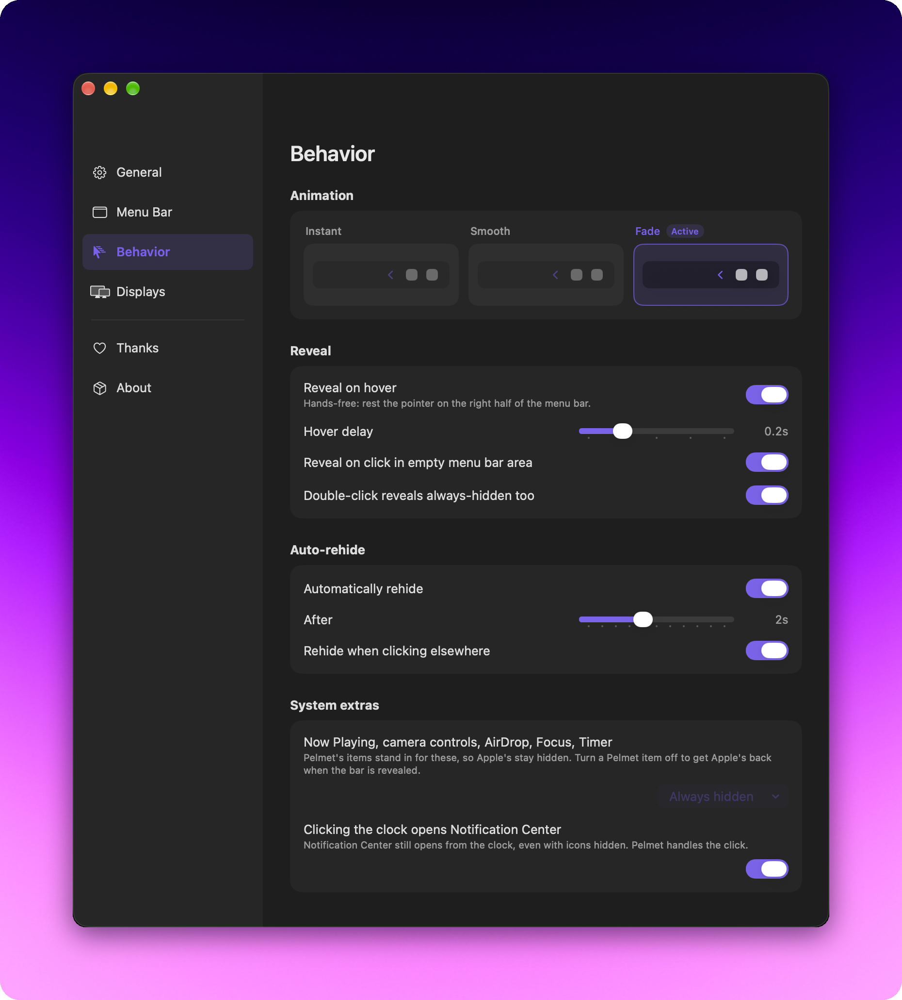
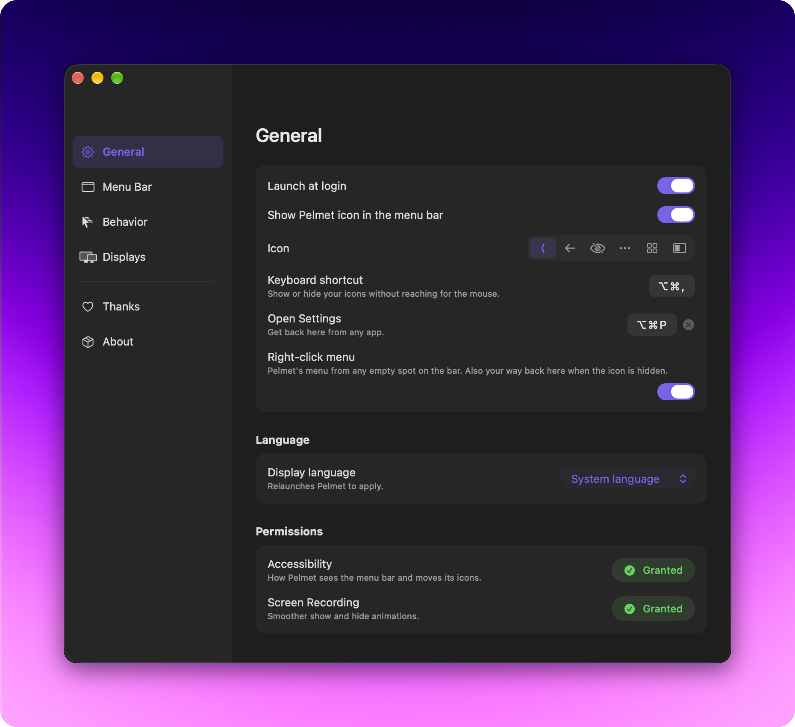

<p align="center">
  
</p>

<p align="center">
  <a href="https://pelmet.fif7y.com"></a>
  <a href="https://github.com/fif7y/pelmet/releases/latest"></a>
  <a href="#install"></a>
  <a href="LICENSE"></a>
  <a href="https://github.com/sponsors/fif7y"></a>
</p>

Pelmet hides the icons you don't need until you do. Hover, click or press a
shortcut and they slide back in. Apple rebuilt the menu bar from the ground
up in macOS 27, and Pelmet is written for that new architecture from day one,
which is why hiding feels like part of the system: no overlay windows, no
fake bars, no icons jumping when the bar reflows. Free and open source.

<p align="center">
  <br>
  <sub>Collapsed, and a hover later.</sub>
</p>

## Choose what stays

Three sections, one rule: **Visible** is always there, **Hidden** comes back
on a hover or a click, and **Always Hidden** only appears when you ask for it
(double-click or ⌥-click the chevron). Arrange them in the layout editor
(real app-icon previews, drag-and-drop ordering), or skip the window entirely
and ⌘-drag icons across the chevron right in the menu bar. Pelmet adopts the
move either way.

<p align="center">
  <br>
  <sub>The layout editor. Drag icons between Visible, Hidden and Always&nbsp;Hidden.</sub>
</p>

System icons hide too. Sound, Battery and friends behave like any
other icon. The few macOS protects (Clock, Control Center, Siri) are shown
locked in the editor rather than pretended away, and anything macOS groups together
gets an honest badge instead of a fake handle.

## Reveal on your terms

Every way back in is a setting: hover (with a delay from 0.1 to 0.5 seconds),
a click on empty menu bar space, a double-click for the always-hidden section,
or the chevron itself. Pick how it looks (**Instant**, **Smooth** or **Fade**)
and how it ends, either auto-rehide after a delay you set (instant to 5
seconds) or the moment you click somewhere else.

<p align="center">
  <br>
  <sub>Your rules for revealing, and for putting everything back.</sub>
</p>

## And the rest

- **Per-display behavior.** Set a display to always show everything or to
  collapse. Whichever display your pointer is on wins.
- **Built-in replacements.** Media controls, AirDrop, camera/mic indicator
  and Shortcuts items that survive hiding, since macOS temporarily removes
  its own extras while hiding is active.
- **Separators.** Visual dividers that behave like icons, with adjustable
  opacity. ⌘-drag them anywhere in the bar.
- **Nothing to phone home about.** No account, no analytics, no server.
  The only connection Pelmet ever makes is checking for its own updates.
- **Signed updates.** Sparkle with EdDSA signatures, checked against a
  signed appcast.
- **Your icon, or none.** Six menu bar icon styles (chevron, arrow, eye,
  dots, grid, panel), or turn the icon off entirely and reach Settings by
  shortcut or right-click.
- **Speaks your language.** English, German, French, Spanish, Italian,
  Portuguese (Brazil), Japanese, Simplified Chinese, Korean and Russian.
  Pelmet follows your system language, or pick one in Settings › General ›
  Language. Translations are machine-drafted for now, corrections are welcome
  in `scripts/gen-xcstrings.py`.

<p align="center">
  <br>
  <sub>General. Pick the icon Pelmet wears, or your language.</sub>
</p>

## How it works

macOS 27's menu bar can hide items natively. It's the mechanism behind the
system's assessment (exam lockdown) mode. Pelmet drives that mechanism directly.
It asserts a configuration listing what should stay visible, and macOS itself
hides the rest and reflows the bar. That's why hiding feels like part of the
system. It *is* the system.

The catch: this API lives in a **private Apple framework**
(`MenuBarClientCore`). It isn't documented or guaranteed, so a macOS update
could change or remove it. Pelmet resolves it at runtime and fails soft. If the
API ever disappears, Pelmet simply reports hiding as unavailable rather than
breaking your menu bar. Everything else (item positions, clicks, previews)
uses public APIs: Accessibility and ScreenCaptureKit.

## Install

Download the latest DMG from [Releases](https://github.com/fif7y/pelmet/releases),
drag Pelmet to Applications, and launch it. Or with Homebrew:

```sh
brew install fif7y/tap/pelmet
```

Requires **macOS 27 (Golden Gate)**. Earlier versions of macOS use a
different menu bar architecture that Pelmet doesn't target.

On first launch Pelmet asks for one permission:

- **Accessibility** (required). How Pelmet sees the menu bar's items and
  positions, and how clicking a hidden item works without revealing
  everything.

Screen Recording is optional, offered next to Accessibility in onboarding
and skippable. The Fade and Instant reveal styles use it to hold a still of
the empty menu bar over the moment icons come back, hiding the slide macOS
plays on its own. Nothing is recorded or kept. The default Smooth style
never asks for it.

Pelmet is notarized by Apple and ships with the hardened runtime. It isn't
sandboxed, managing the menu bar requires APIs the App Store sandbox
forbids.

More in the [FAQ](docs/FAQ.md).

## Build from source

Requires Xcode with the macOS 27 SDK and [xcodegen](https://github.com/yonaskolb/XcodeGen).

```sh
git clone https://github.com/fif7y/pelmet.git
cd pelmet
xcodegen
xcodebuild -project Pelmet.xcodeproj -scheme Pelmet -configuration Release build
```

The engine logic lives in two local Swift packages, `Packages/PelmetCore`
(section model, rehide state machine) and `Packages/PelmetEngine` (menu bar
convergence), each with its own test suite:

```sh
swift test --package-path Packages/PelmetCore
swift test --package-path Packages/PelmetEngine
```

UI strings live in `Pelmet/Resources/Localizable.xcstrings`, generated from
the translation table in `scripts/gen-xcstrings.py`. Edit the script, re-run
it, commit both. English keys must match the code literals exactly.

## Why "Pelmet"

*pelmet* (n.), a narrow border of cloth or wood, fitted across the top of a
window to conceal the curtain fittings. Now also the same thing, for your menu bar.

## Licenses & acknowledgements

Pelmet was inspired by [Ice](https://github.com/jordanbaird/Ice), the open-source
menu bar manager for earlier versions of macOS. Apple's macOS 27 rebuild of the
menu bar doesn't carry the old architecture forward, so Ice and the other
managers built on it stop working there. Pelmet takes over from macOS 27 on,
rebuilt from scratch for the new architecture (no code is shared between the
projects).

Pelmet's only third-party dependency is
[Sparkle](https://github.com/sparkle-project/Sparkle) (in-app updates), used
under the [MIT-style Sparkle license](https://github.com/sparkle-project/Sparkle/blob/2.x/LICENSE).
Everything else is custom code on top of Apple's system frameworks.

## License

© 2026 Gabriel Faucon. Licensed under the
[GNU General Public License v3.0](LICENSE). Use it, fork it.
Distributed derivatives must remain open under the same license.

Pelmet is an independent project, not affiliated with or endorsed by Apple Inc.
Apple, macOS, and the Mac are trademarks of Apple Inc.
